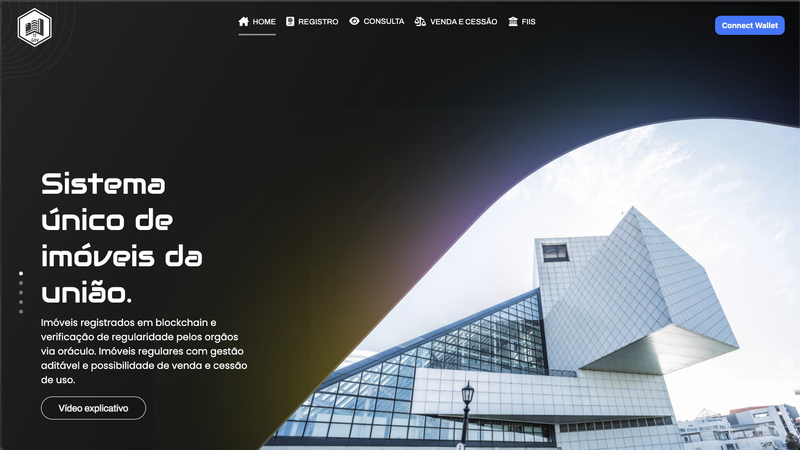

<div align="center">

[](https://travis-ci.org/rmanguinho/clean-react)
[](https://coveralls.io/github/rmanguinho/clean-react?branch=master)
[](https://snyk.io/test/github/rmanguinho/clean-react)
[](http://standardjs.com)
[](https://opensource.org/licenses/)
[](https://opensource.org/)
</div>


<div align='center'>

# **Gerenciamento de Imóveis baseado em Blockchain**
</div>


[](https://www.udemy.com/course/react-com-mango/?referralCode=552F88858EAE76346C8B)

Esse sistema faz o uso de blockChain no gerenciamento de imoveis usando o protocolo ERC721, erc4907 e tokenização para NFTs como registro e alterações cadastrais.

O objetivo é implementar um sistema gerenciador de Registros Imoveis usando as tecnologias recentes. O Back-End desenvolvido em solidity juntamente com ethers, hardhat, typescript e compiladores em linguagem Solidity. 

Para Front-End foi desenvolvida utilizando diversos metodologias como uma arquitetura bem definida e desacoplada, utilizando TDD (programação orientada a testes) como metodologia de trabalho, Clean Architecture para fazer a distribuição de responsabilidades em camadas, sempre seguindo os princípios do SOLID, DRY, YAGNI, KISS e aplicando Design Patterns para resolver alguns problemas comuns.
<br /><br />

<div align="center" style="width: 100%; display: block;">

 
</div>


</div>


<div style="padding: 0 5rem;">


# Indice

- [Sobre](#ComoFunciona)
- [Metodologias utilizadas](#MetodologiasUtilizadas)
- [Tecnologias Utilizadas](#TecnologiasUtilizadas)
- [Como executar o projeto](#Execute)

<div id="ComoFunciona">

## 🔖&nbsp; Como Funciona?
</div>


A BlockImobGov é uma plataforma de consulta de regularidade
baseada em oráculo, registro e gestão de imóveis da União
registrados em Blockchain que permite aos usuários investir e
acompanhar seus contratos com a União.
Como funciona : 
REGISTRO
Lista de endereços cadastrados na blockchain e implementação de
multisig do gov. Criação de NFT (Tokens não fungíveis) com definições
dos imóveis registrados por entes autorizados. Toda a gestão dos imóveis
registrados em um sistema público e auditável.
CONSULTA
Verificação de regularidade e dados dos imóveis. Toda os dados dos
imóveis passa pela verificação dos validadores no oráculo dos entes
governamentais para garantir a veracidade das informações. Possibilidade
de solicitar a confrontação de mapas referente a geolocalização de
imóveis rurais.
VENDA E CESSÃO
Após a confirmação que os imóveis estão regulares eles estarão hábeis
para a venda ou cessão de uso. Todo o valor será pago em cReal
(Criptomoeda lastreada em real da blockchain da Celo). O prazo de
cessão será definido em código e estipulado o pagamento por período
especificado em contrato, já com o abatimento dos tributos.
FII TOKENIZADO
Com todos os imóveis registrados e regularizado na blockchain, assim
tendo todas as definições essenciais on-chain e metadados de cada
imóvel. O sistema possibilitará a tokenização dos fundos imobiliários com
todos os dados referente aos imóveis de cada fundo e sua categoria.

BlockImobGov Acelerando os negócios imobiliários do Governo!

---

<div id="MetodologiasUtilizadas">

 ## ㊎ Metodologias utilizadas para desenvolvimento
</div>


* TDD
* Clean Architecture
* DDD
* Reactive Programming
* Responsive Layout
* Conventional Commits
* GitFlow
* Modular Design
* Dependency Diagrams
* Use Cases
* Continuous Integration
* Continuous Delivery
* Continuous Deployment

## 📚 Princípios

* Single Responsibility Principle (SRP)
* Open Closed Principle (OCP)
* Liskov Substitution Principle (LSP)
* Interface Segregation Principle (ISP)
* Dependency Inversion Principle (DIP)
* Separation of Concerns (SOC)
* Don't Repeat Yourself (DRY)
* You Aren't Gonna Need It (YAGNI)
* Keep It Simple, Silly (KISS)
* Composition Over Inheritance
* Small Commits

## ㌥ Design Patterns

* Factory
* Adapter
* Composite
* Decorator
* Dependency Injection
* Composition Root
* Builder
* Proxy

<div id="TecnologiasUtilizadas">

## 🚀 Tecnologias utilizadas
</div>


* [Typescript](https://www.typescriptlang.org/)
* [React](https://www.typescriptlang.org/)
* [React Testing Library](https://www.typescriptlang.org/)
* [React Router DOM](https://reactrouter.com/en/main)
* [Vitest](https://vitest.dev/)
* [Git](https://git-scm.com/)
* [Styled-Components](https://styled-components.com/)
* [Yarn](https://yarnpkg.com/)
* [Coveralls](https://coveralls.io/)
* [Husky](https://typicode.github.io/husky/#/)
* [Lint Staged](https://github.com/okonet/lint-staged)
* [Eslint](https://eslint.org/)
* [Celo Blockchain](https://celo.org/)
  
---
---

<div id="Execute">

## 🗂 Como executar o Client (Front-End)
</div>

```bash

    # Clonar o repositório
    $ git clone https://github.com/renancorreadev/blockchainImob.git

    # Entrar no diretório
    $ cd frontend

    # Instalar as dependências
    $ yarn install

    # Iniciar o projeto
    $ yarn dev
```

---

## 🗂 Como compilar os contratos e realizar deploy (back-end)

```bash

    # Clonar o repositório
    $ git clone https://github.com/renancorreadev/blockchainImob.git

    # Entrar no diretório
    $ cd backend

    # Instalar as dependências
    $ yarn install

    # Iniciar o projeto
    $ yarn compile

    # Deployar os contratos
    $ yarn deploy

    # Verificar os contratos
    $ yarn verify
```

---

<p align="center"> 

    Desenvolvido por Renan César
</p>

</div>

